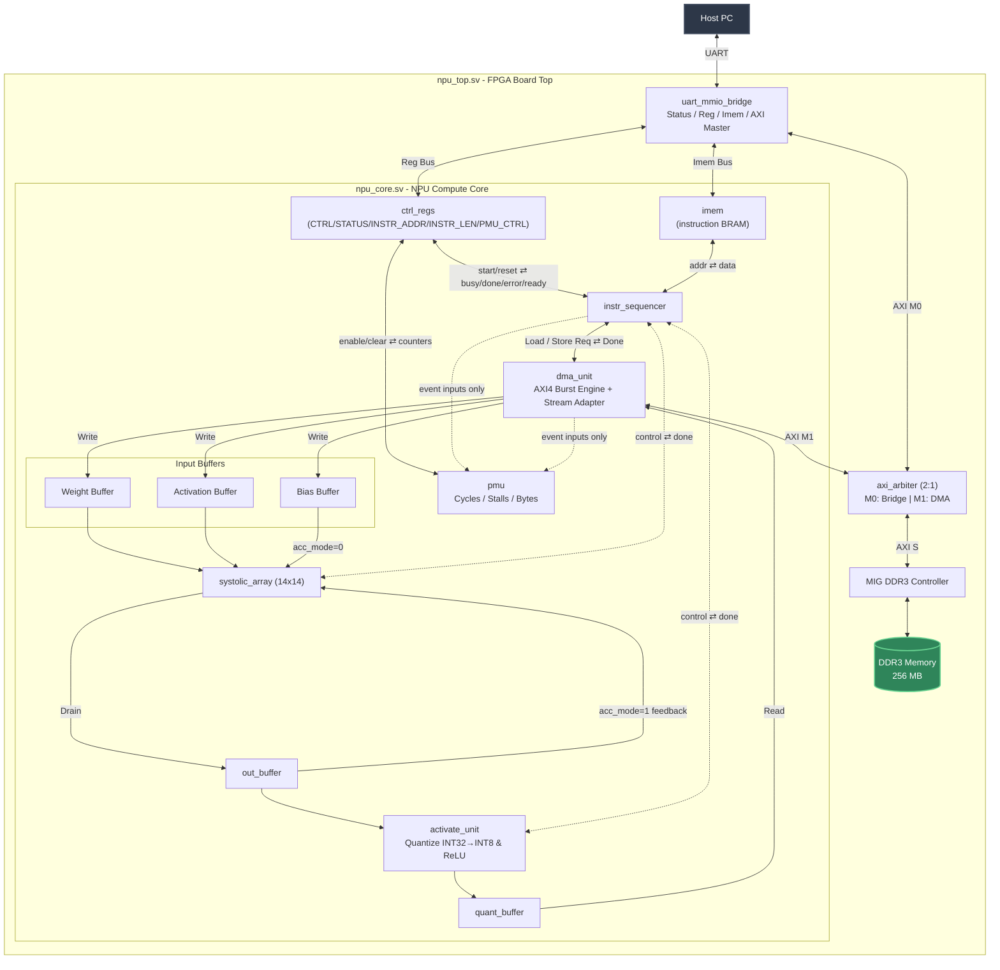

# Macaque

A vertically integrated custom AI accelerator and software toolchain stack. 

The design is implemented on the QMTECH Wukong V3 development board, which features a Xilinx Artix-7 XC7A100T FPGA.

**Status**: 
* Hardware has a working iteration on real silicon. 
* The software stack, which includes the simulator, codegen (or compiler backend) and runtime, is currently work in progress.

---

## Hardware

| **Component** | **Part** |
|---|---|
| FPGA | Xilinx Artix-7 XC7A100T-1FGG676C |
| Board | QMTECH XC7A100T Wukong V3 |
| Clock | 50 MHz on-board crystal |
| DSP slices | 240 × DSP48E1 |
| Block RAM | 135 × BRAM36 (4,860 Kb) |
| DDR3 | 256 MB Micron MT41K128M16JT-125:K |
| Ethernet | Realtek RTL8211EG (1 Gbps) |
| UART | CH340N USB-UART bridge |

---

## Architecture



**Currently within a single clock domain.** Everything in `npu_top.sv`/`npu_core.sv` (sequencer, buffers, systolic array, DMA, UART bridge) runs on MIG's `ui_clk` (~83.33 MHz). This is done for simplicity. Future enhancement is a separate fast compute clock decoupled from `ui_clk`.

---

## ISA

### Instruction format

Every instruction is a fixed-width 64-bit word

| Field | Bits | Width | Meaning |
|---|---|---|---|
| `opcode` | `[63:60]` | 4 | see [opcode](#opcodes) table below |
| `acc_mode` | `[59]` | 1 | Used in OP_MATMUL only: 1 = accumulate results (for tiling) |
| `target` | `[58:56]` | 3 | Currently only used by OP_ACTIVATE |
| `ddr3_addr` | `[55:28]` | 28 | byte address into DDR3 (256 MB space) |
| `byte_count` | `[27:12]` | 16 | transfer size in bytes (LOAD/STORE) |
| `tile_params` | `[11:0]` | 12 | tile size (essentially number of rows to feed, used only in OP_MATMUL and OP_ACTIVATE) |

### Opcodes
| Opcode | Value | Effect |
|---|---|---|
| `OP_LOAD_WEIGHT` | `0x0` | load a weight tile from DDR3 on-chip |
| `OP_LOAD_BIAS` | `0x1` | load a bias tile from DDR3 on-chip |
| `OP_LOAD_INPUT` | `0x2` | load an activation (input) tile from DDR3 on-chip |
| `OP_MATMUL` | `0x3` | run the 14×14 array over the loaded tile, producing INT32 results |
| `OP_ACTIVATE` | `0x4` | requantize the INT32 results to INT8, applying an activation function (or none) |
| `OP_STORE` | `0x5` | write the INT8 result tile back to DDR3 |
| `OP_SYNC` | `0x6` | barrier between the DMA and compute lanes |

### ACTIVATE field reinterpretation

`OP_ACTIVATE` packs different data into the generic layout above:

| Field | Bits | Meaning |
|---|---|---|
| `act_func` | `[58:56]` (`target`) | `0`=ReLU, `1`=leaky-ReLU (α=2⁻⁴, fixed), `2`=passthrough |
| `act_scale_m` | `[55:28]` (`ddr3_addr`) | requantize multiplier (fixed-point) |
| `act_scale_shift` | `[16:12]` (`byte_count[4:0]`) | requantize right-shift |
| `act_num_rows` | `[7:0]` (`tile_params[7:0]`) | rows to requantize |

`[15:5]` is reserved for a per-instruction leaky-ReLU slope which is not yet wired up. The shift is currently the global `LEAKY_RELU_SHIFT` constant.

## Register map

Host-facing, 64-bit registers at `REG_BASE = 0x4000_0000` (`ctrl_regs.sv`), accessed via the byte offset below:

| Register | Offset | R/W | Notes |
|---|---|---|---|
| `CTRL` | `0x00` | W | bit0 = start (write-1 pulse), bit1 = reset (level) |
| `STATUS` | `0x08` | R | bit0 = ready, bit1 = busy, bit2 = done, bit3 = error |
| `INSTR_ADDR` | `0x10` | W | byte offset of the first instruction in `imem` for this run |
| `INSTR_LEN` | `0x18` | W | instruction count |
| `PMU_CTRL` | `0x20` | W | bit0 = enable (level), bit1 = clear (write-1 pulse) |
| `PMU_CYCLES` | `0x28` | R | 64-bit total cycles |
| `PMU_COMPUTE` | `0x30` | R | cycles the array was actively MACing |
| `PMU_STALL` | `0x38` | R | cycles blocked on DMA/buffer-not-ready/sync |
| `PMU_DMA_BYTES_RD` | `0x40` | R | bytes read by the DMA engine |
| `PMU_DMA_BYTES_WR` | `0x48` | R | bytes written by the DMA engine |

## Host wire protocol

The UART bridge to the MMIO uses a 3-command protocol:

| Command | Byte | Payload out | Payload back |
|---|---|---|---|
| `STATUS` | `0x53` ('S') | - | 1 byte: bit0 = `mmcm_locked`, bit1 = `init_calib_complete` |
| `WRITE` | `0x57` ('W') | 4-byte addr (LE) + 8-byte data (LE) | 1 byte ack (`0x00`) |
| `READ` | `0x52` ('R') | 4-byte addr (LE) | 8-byte data (LE) |

The top byte of the 4-byte address selects the target: `0x40` goes to control registers, `0x50` goes to instruction memory , anything else goes to DDR3.

## Memory map

### Top-level address space
| Range | Size | Target |
|---|---|---|
| `0x0000_0000` – `0x0FFF_FFFF` | 256 MB | DDR3 (via `dma_unit`'s AXI4 path) |
| `0x4000_0000` – `0x40FF_FFFF` | - | register map |
| `0x5000_0000` – `0x50FF_FFFF` | - | instruction memory (`IMEM_BASE`, 4096 × 64-bit words) |

---

## Build

### Prerequisites
- Vivado ML Edition v2025.2 (Artix-7 device support)
- CMake 3.28
- GCC or Clang with C++20 support
- Python 3.12 (For hardware simulation and testing)
    - Install packages in `requirements.txt`
- llvm with mlir
    - Can be installed and built via [this script](build_llvm_mlir.sh)

### Hardware
To do a full build and program the FPGA:
```bash
make hw
```

Alternatively, each individual stage can be carried out separately:
```bash
make -C hw synth
make -C hw impl
make -C hw bitstream
make -C hw program
```

#### Testing the build
After programming the fpga, you can test it with:

```bash
make test_hw
```

What the test does:
* Load 100 x 130 and 130 x 150 matrices onto the FPGA memory
* Load instructions to multiply the two loaded matrices and trigger execution on the hardware
* Reads back the output and verify correctness against expected host results

#### Running testbenches on simulated hardware
Refer to [README](hw/sim/README.md) in `hw/sim`.

### Software (WIP)

To configure and build all C++ components
```bash
make sw
```

To run unit tests:
```bash
make test_sw
```

