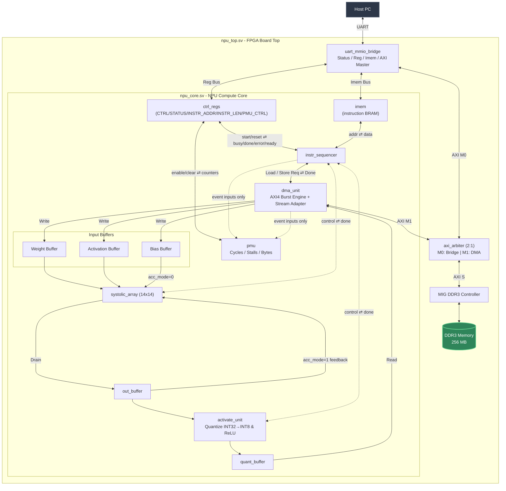

# Macaque

A vertically integrated custom AI accelerator and software toolchain.

The AI accelerator, *Macaque NPU*, is implemented on the Xilinx Artix-7 XC7A100T FPGA on a QMTECH Wukong V3 development board, and features a 14×14 INT8 systolic array.

The software toolchain consists of:
* Macaque compiler backend (via `macaque-lower`, see [codegen](sw/codegen/)): lowers a limited subset of TOSA IR to Macaque NPU instructions, generating the program file consumed by the runtime
* Macaque runtime (via `macaque`, see [runtime](sw/runtime/)): handles I/O between the host computer and Macaque NPU - loading instructions, weights, biases, and input data, and reading back outputs
* Behavioural simulator (see [simulator](sw/simulator/)): a library that simulates Macaque NPU's execution in software

> [!NOTE]
> This project is still under active development. A full pipeline runs end-to-end on real FPGA hardware, but many features are missing or unstable.

## Usage
1. Train the weights on host computer. Can use any ML compiler frontend as long as the output can be lowered to TOSA IR, limited to TOSA operations that are actually supported by `macaque-lower` and the Macaque NPU itself. [`sw/runtime/examples/mnist_mlp.mlir`](sw/runtime/examples/mnist_mlp.mlir) is an example TOSA IR file: the output of training a small INT8 MNIST classifier .
2. `macaque-lower` compiles that TOSA IR into the program which includes the Macaque instruction stream plus its DDR3 layout (weights, biases, and where a runtime input/output belongs)
   ```sh
   macaque-lower mnist_mlp.mlir -o mnist_mlp.json
   ```

    [`sw/runtime/examples/mnist_mlp.json`](sw/runtime/examples/mnist_mlp.json) is the program generated from [`sw/runtime/examples/mnist_mlp.mlir`](sw/runtime/examples/mnist_mlp.mlir)
3. Run the compiled program against real hardware with `macaque`, or link `macaque_runtime` directly into your own application (see [sw/runtime/examples/infer_image.cpp](sw/runtime/examples/)).
   ```sh
   macaque run mnist_mlp.json --port /dev/ttyUSB0 --image digit.png --scale 2.0079
   ```


---

## Hardware

| **Component** | **Part** | **Remark**|
|---|---|---|
| FPGA | Xilinx Artix-7 XC7A100T-1FGG676C |
| Board | QMTECH XC7A100T Wukong V3 |
| Clock | 50 MHz on-board crystal |
| DSP slices | 240 × DSP48E1 |
| Block RAM | 135 × BRAM36 (4,860 Kb) |
| DDR3 | 256 MB Micron MT41K128M16JT-125:K |
| Ethernet | Realtek RTL8211EG (1 Gbps) | Currently unused. **Future scope**: mode of communication used by host to read/write DDR3
| UART | CH340N USB-UART bridge | Used for all mode of communication between host and device

---

## Architecture



**Currently within a single clock domain.** Everything in `npu_top.sv`/`npu_core.sv` (sequencer, buffers, systolic array, DMA, UART bridge) runs on MIG's `ui_clk` (~83.33 MHz). This is done for simplicity. Future enhancement is a separate fast compute clock decoupled from `ui_clk`.

---

## ISA

Every instruction is a fixed-width 64-bit word. Only `opcode` (`[63:60]`) has
a fixed meaning across every instruction - each opcode packs the rest of the
word differently, documented per-opcode below.

### Opcodes
| Opcode | Value | Effect |
|---|---|---|
| `OP_LOAD_WEIGHT` | `0x0` | load a weight tile from DDR3 on-chip |
| `OP_LOAD_BIAS` | `0x1` | load a bias tile from DDR3 on-chip |
| `OP_LOAD_INPUT` | `0x2` | load an activation (input) tile from DDR3 on-chip |
| `OP_MATMUL` | `0x3` | run the 14×14 array over the loaded tile, producing INT32 results |
| `OP_ACTIVATE` | `0x4` | requantize the INT32 results to INT8, applying an activation function (or none) |
| `OP_STORE` | `0x5` | write the INT8 result tile back to DDR3 |
| `OP_SYNC` | `0x6` | barrier between the DMA and compute lanes |

### LOAD_WEIGHT / LOAD_BIAS / STORE

| Field | Bits | Width | Meaning |
|---|---|---|---|
| `ddr3_addr` | `[55:28]` | 28 | byte address into DDR3 (256 MB space) |
| `byte_count` | `[27:12]` | 16 | transfer size in bytes |

### LOAD_INPUT

| Field | Bits | Width | Meaning |
|---|---|---|---|
| `ddr3_addr` | `[55:28]` | 28 | byte address into DDR3 |
| `byte_count` | `[27:12]` | 16 | transfer size in bytes - the padded tile size normally, or the true/dense size when zero-injection (below) is active |
| `valid_bytes_per_row` | `[11:8]` | 4 | DMA zero-injection: real bytes per row. `0` = disabled, every row is fully real |
| `input_rows` | `[7:0]` | 8 | this transfer's row count - only meaningful when `valid_bytes_per_row != 0` |

`valid_bytes_per_row`/`input_rows` exist for a runtime activation input whose
K isn't a multiple of the 14-wide tile so the DMA can zero-fill the rest of each
row on the way into the activation buffer

### MATMUL

| Field | Bits | Width | Meaning |
|---|---|---|---|
| `acc_mode` | `[59]` | 1 | `1` = accumulate into out_buffer (K-tiling) |
| `weight_hold` | `[56]` (`target[0]`) | 1 | `1` = reuse the currently-loaded weight/bias bank instead of a fresh load - weight-stationary M-streaming |
| `mat_row_base` | `[7:0]` (`ddr3_addr[7:0]`) | 8 | out_buffer row this M-chunk's accumulator starts at - `0` except weight-hold combined with K-tiling |
| `tile_params` | `[7:0]` | 8 | row count (M) to feed |

### ACTIVATE

| Field | Bits | Width | Meaning |
|---|---|---|---|
| `act_func` | `[58:56]` (`target`) | 3 | `0`=ReLU, `1`=leaky-ReLU ($\alpha = 2^{-4}$, fixed), `2`=passthrough |
| `act_scale_m` | `[55:39]` (`ddr3_addr[27:11]`) | 17 | requantize multiplier (fixed-point) |
| `act_bank_hold` | `[25]` (`byte_count[13]`) | 1 | `1` = skip the `out_bank_sel` toggle |
| `act_row_base` | `[24:17]` (`byte_count[12:5]`) | 8 | out_buffer row this M-chunk's accumulator starts at |
| `act_scale_shift` | `[16:12]` (`byte_count[4:0]`) | 5 | requantize right-shift |
| `act_num_rows` | `[7:0]` (`tile_params`) | 8 | rows to requantize |

### SYNC
No fields - opcode only.

## Register map

Host-facing, 64-bit registers at `REG_BASE = 0x4000_0000` (`ctrl_regs.sv`), accessed via the byte offset below:

| Register | Offset | R/W | Notes |
|---|---|---|---|
| `CTRL` | `0x00` | W | bit0 = start (write-1 pulse), bit1 = reset (level) |
| `STATUS` | `0x08` | R | bit0 = ready, bit1 = busy, bit2 = done, bit3 = error |
| `INSTR_ADDR` | `0x10` | W | byte offset of the first instruction in `imem` for this run |
| `INSTR_LEN` | `0x18` | W | instruction count |
| `PMU_CTRL` | `0x20` | W | bit0 = enable (level), bit1 = clear (write-1 pulse) |
| `PMU_CYCLES` | `0x28` | R | 64-bit total cycles |
| `PMU_COMPUTE` | `0x30` | R | cycles the array was actively MACing |
| `PMU_STALL` | `0x38` | R | cycles blocked on DMA/buffer-not-ready/sync |
| `PMU_DMA_BYTES_RD` | `0x40` | R | bytes read by the DMA engine |
| `PMU_DMA_BYTES_WR` | `0x48` | R | bytes written by the DMA engine |

## Host wire protocol

The UART bridge to the MMIO uses a 3-command protocol:

| Command | Byte | Payload out | Payload back |
|---|---|---|---|
| `STATUS` | `0x53` ('S') | - | 1 byte: bit0 = `mmcm_locked`, bit1 = `init_calib_complete` |
| `WRITE` | `0x57` ('W') | 4-byte addr (LE) + 8-byte data (LE) | 1 byte ack (`0x00`) |
| `READ` | `0x52` ('R') | 4-byte addr (LE) | 8-byte data (LE) |

The top byte of the 4-byte address selects the target: `0x40` goes to control registers, `0x50` goes to instruction memory , anything else goes to DDR3.

## Memory map

### Top-level address space
| Range | Size | Target |
|---|---|---|
| `0x0000_0000` – `0x0FFF_FFFF` | 256 MB | DDR3 (via `dma_unit`'s AXI4 path) |
| `0x4000_0000` – `0x40FF_FFFF` | - | register map |
| `0x5000_0000` – `0x50FF_FFFF` | - | instruction memory (`IMEM_BASE`, 4096 × 64-bit words) |

---

## Build

### Prerequisites
- Vivado ML Edition v2025.2 (Artix-7 device support)
- CMake 3.28
- GCC or Clang with C++20 support
- Python 3.12 (For hardware simulation and testing)
    - Install packages in `requirements.txt`
- llvm with mlir
    - Can be installed and built via [this script](build_llvm_mlir.sh)

### Hardware
To do a full build and program the FPGA:
```bash
make hw
```

Alternatively, each individual stage can be carried out separately:
```bash
make -C hw synth
make -C hw impl
make -C hw bitstream
make -C hw program
```

#### Testing the build
After programming the fpga, you can test it with:

```bash
make test-hw
```

What the test does:
* Load 100 x 130 and 130 x 150 matrices onto the FPGA memory
* Load instructions to multiply the two loaded matrices and trigger execution on the hardware
* Reads back the output and verify correctness against expected host results

#### Running testbenches on simulated hardware
Refer to [README](hw/sim/README.md) in `hw/sim`.

### Software

To configure and build all C++ components as well as install the relevant binaries
```bash
make sw
```

The `macaque-lower` and `macaque` binaries can be found in the `bin` folder at the root of the repository. To learn more about usage, run them with `--help`. 

To run unit tests:
```bash
make test-sw
```

